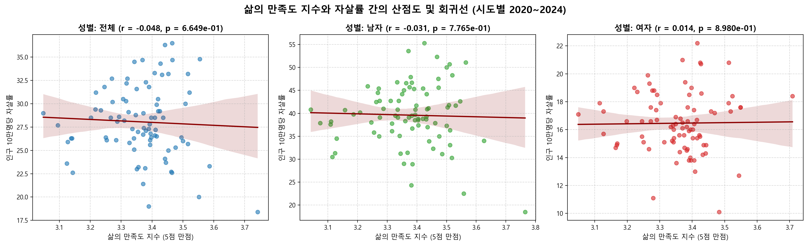
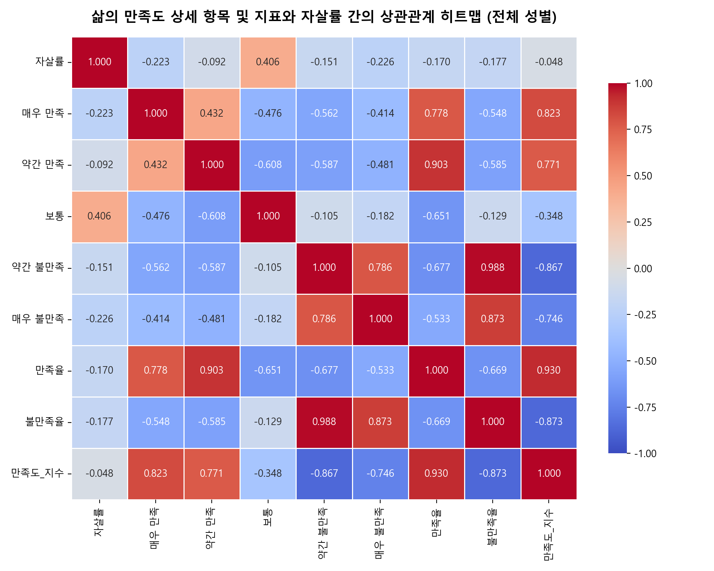
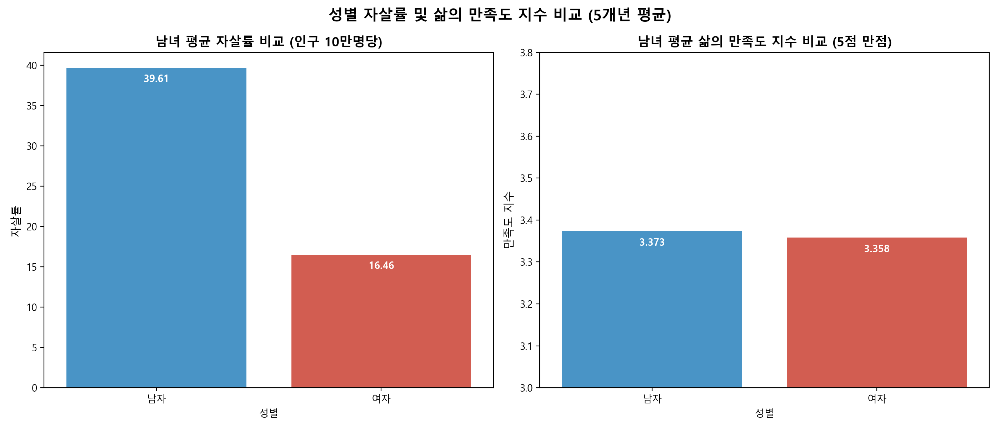
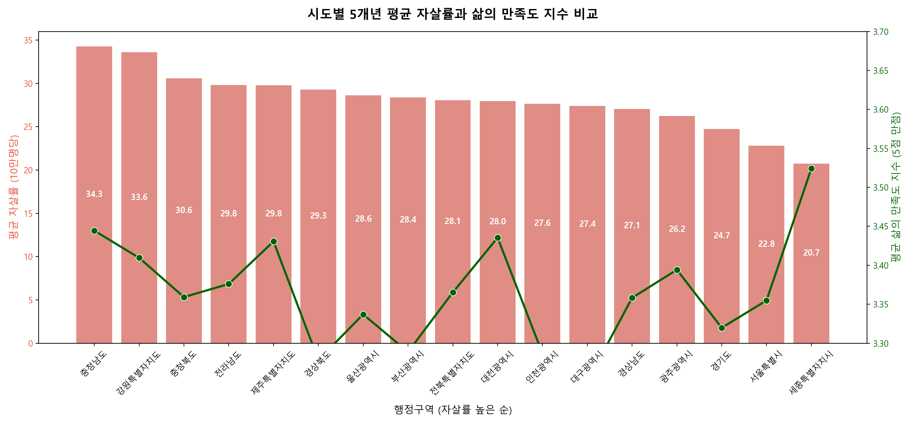
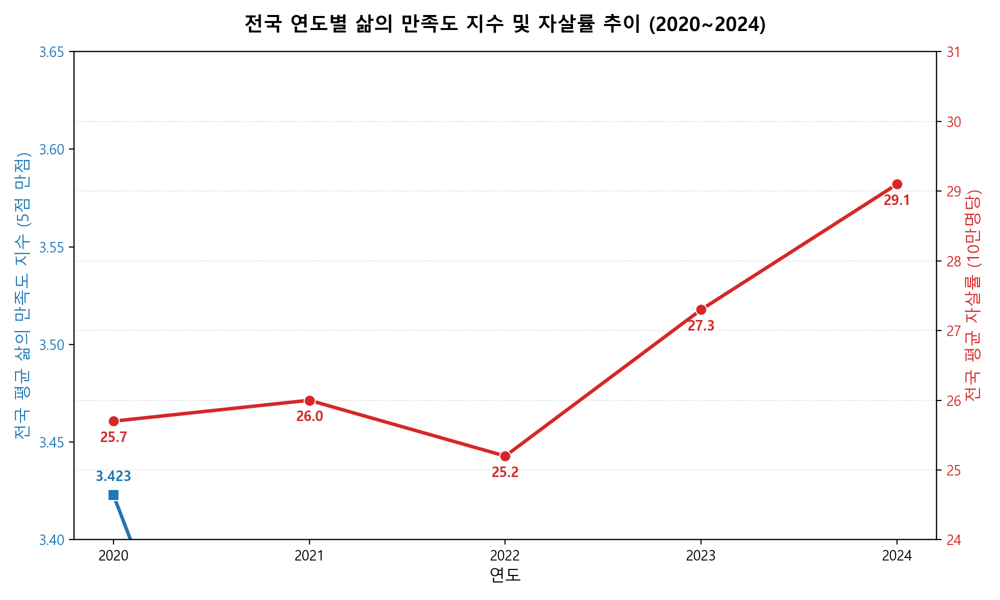
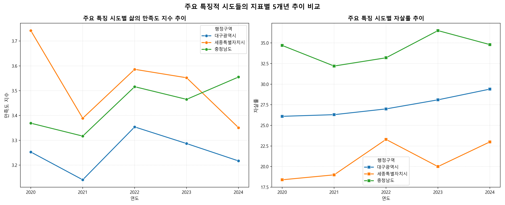

# [분석 보고서] 대한민국 시도별 삶의 만족도와 자살률 간의 상관관계 분석 (2020~2024)

## 1. 요약 (Executive Summary)
본 보고서는 대한민국 통계청의 5개년(2020~2024년) 데이터를 활용하여 **시도별 삶의 만족도**와 **인구 10만 명당 자살률** 간의 상관관계를 다각도로 분석하였습니다. 

* **전체 상관관계**: 5개년 누적 데이터(N=255) 분석 결과, 삶의 만족도 지수와 자살률 간의 선형 상관관계는 거의 나타나지 않았습니다 (Pearson $r = -0.0477$, $p = 0.665$). 이는 자살률이 단순히 삶의 만족도라는 단일 차원의 설문 지표만으로는 설명하기 힘든 복합적 요인(경제적 요인, 사회적 고립, 정신건강 인프라 등)의 영향을 받음을 시사합니다.
* **코로나19 팬데믹 초기(2020년)의 특이성**: 연도별 개별 분석 시 **2020년에는 뚜렷한 음의 상관관계(Pearson $r = -0.5135$, $p = 0.0350$)**가 관찰되었습니다. 즉, 코로나19 발생 첫해에는 삶의 만족도가 높은 지역일수록 자살률이 통계적으로 유의미하게 낮았습니다. 그러나 2021년 이후 사회적 거리두기 장기화 및 일상 회복 과정에서는 이러한 지역적 상관성이 사라졌습니다.
* **성별 차이**: 남성의 평균 자살률(37.36명)은 여성(16.06명)에 비해 약 2.3배 높았으나, 삶의 만족도 평균 지수는 남성(3.348점)과 여성(3.335점) 간에 큰 차이가 없었습니다. 성별 분석에서도 삶의 만족도와 자살률 간의 유의미한 선형 상관관계는 발견되지 않았습니다.
* **지역적 양극화**: **세종특별자치시**는 가장 높은 삶의 만족도 지수(3.524점)와 가장 낮은 자살률(20.74명)을 기록하며 가장 이상적인 지표를 보인 반면, **충청남도**와 **강원특별자치도**는 삶의 만족도가 비교적 높음에도 불구하고 자살률이 각각 34.28명, 33.60명으로 가장 높은 수준을 기록하는 독특한 불일치(Decoupling) 현상을 보였습니다.

---

## 2. 데이터 및 분석 방법론

### 2.1. 분석 데이터
1. **삶의 만족도 데이터**: 통계청 「사회조사」 (조회기간: 2020~2024년)
   - 설문 문항: "현재 전반적인 삶에 얼마나 만족하십니까?" (단위: %)
   - 응답 범주: 매우 만족, 약간 만족, 보통, 약간 불만족, 매우 불만족
2. **자살률 데이터**: 통계청 「사망원인통계」 (조회기간: 2020~2024년)
   - 인구 10만 명당 자살사망자 수 (단위: 명)

### 2.2. 지표 정의 및 전처리
* **행정구역 통일**: 두 데이터 간 행정구역 명칭 차이(예: '전라북도' $\rightarrow$ '전북특별자치도', '제주도' $\rightarrow$ '제주특별자치도')를 표준화하여 17개 시도 및 전국 평균 데이터를 일치시켰습니다.
* **삶의 만족도 지수 (Weighted Score)**: 5점 리커트 척도 가중치를 적용하여 종합 지수를 산출했습니다.
  $$\text{삶의 만족도 지수} = \frac{(\text{매우 만족} \times 5) + (\text{약간 만족} \times 4) + (\text{보통} \times 3) + (\text{약간 불만족} \times 2) + (\text{매우 불만족} \times 1)}{100}$$
* **만족율 및 불만족율**: 
  - $\text{만족율} = \text{매우 만족} + \text{약간 만족}$ (%)
  - $\text{불만족율} = \text{매우 불만족} + \text{약간 불만족}$ (%)
* **상관분석 방법**: 피어슨(Pearson) 및 스피어먼(Spearman) 상관계수를 활용하여 선형성 및 순위 상관성을 분석했습니다. 지역 간 편향을 방지하기 위해 전국 평균('전국') 데이터는 상관분석에서 제외했습니다.

---

## 3. 상세 분석 결과

### 3.1. 전체 상관관계 분석 (전국 제외, N = 255)
5개년의 모든 시도 및 성별 데이터를 통합하여 분석한 결과는 다음과 같습니다.

| 성별 구분 | 만족도 지표 | 피어슨 상관계수 ($r$) | p-value | 유의성 여부 |
| :--- | :--- | :---: | :---: | :---: |
| **전체 (Total)** | 만족도 지수 (5점 만점) | -0.0477 | 0.6649 | 유의하지 않음 |
| | 만족율 (%) | -0.1704 | 0.1189 | 유의하지 않음 (p < 0.12) |
| | 불만족율 (%) | -0.1767 | 0.1058 | 유의하지 않음 (p < 0.11) |
| **남자 (Male)** | 만족도 지수 (5점 만점) | -0.0313 | 0.7765 | 유의하지 않음 |
| | 만족율 (%) | -0.1208 | 0.2708 | 유의하지 않음 |
| | 불만족율 (%) | -0.1765 | 0.1062 | 유의하지 않음 |
| **여자 (Female)** | 만족도 지수 (5점 만점) | 0.0141 | 0.8980 | 유의하지 않음 |
| | 만족율 (%) | -0.0422 | 0.7015 | 유의하지 않음 |
| | 불만족율 (%) | -0.0674 | 0.5402 | 유의하지 않음 |

* **해석**: 5개년 통합 분석 시, 전반적으로 삶의 만족도가 높거나 불만족도가 낮다고 해서 자살률이 낮아지는 뚜렷한 경향성은 관찰되지 않았습니다. 만족율 및 불만족율이 자살률과 약한 음의 상관관계($r \approx -0.17$)를 보이나 통계적 유의 수준($p < 0.05$)에는 미치지 못했습니다.

### 3.2. 연도별 상관관계 분석 (전체 성별, 전국 제외, N = 17)
각 연도별로 17개 시도의 자살률과 삶의 만족도 지수 간의 피어슨 상관관계를 분석한 결과, 흥미로운 시간적 변화가 관찰되었습니다.

* **2020년**: $r = -0.5135$ ($p = 0.0350$) $\rightarrow$ **통계적으로 유의미한 음의 상관관계**
* **2021년**: $r = 0.0499$ ($p = 0.8493$) $\rightarrow$ 상관관계 없음
* **2022년**: $r = 0.0771$ ($p = 0.7686$) $\rightarrow$ 상관관계 없음
* **2023년**: $r = -0.1087$ ($p = 0.6778$) $\rightarrow$ 상관관계 없음
* **2024년**: $r = 0.2296$ ($p = 0.3753$) $\rightarrow$ 상관관계 없음 (오히려 약한 양의 경향성)

> [!NOTE]
> **2020년 유의성 분석**: 코로나19 팬데믹 첫해에는 지역 사회의 심리적 회복탄력성(삶의 만족도)이 자살률 억제에 유의미한 변수로 작동했을 가능성이 큽니다. 그러나 팬데믹이 장기화된 2021년 이후에는 사회적 거리두기의 만성화, 경제적 불평등 심화 등으로 인해 심리적 변수와 실질 자살률 간의 연결고리가 약화되었음을 보여줍니다.

---

## 4. 성별 및 지역별 비교 분석

### 4.1. 성별 지표 비교
* **평균 자살률**: 남성 37.36명 >> 여성 16.06명 (남성이 약 **2.33배** 높음)
* **평균 삶의 만족도 지수**: 남성 3.348점 $\approx$ 여성 3.335점 (성별 간 유의미한 만족도 차이 없음)
* **결론**: 여성이 주관적인 삶의 만족도는 남성과 비슷하게 느끼거나 약간 낮게 느끼더라도, 실제 자살로 이어지는 비율은 남성이 압도적으로 높습니다. 이는 자살에 작용하는 위험 인자와 대처 기제(Coping mechanism)가 남녀 간에 크게 다름을 보여줍니다.

### 4.2. 시도별 5개년 평균 데이터 비교 (자살률 높은 순)

| 행정구역 | 삶의 만족도 지수 (5점) | 만족율 (%) | 불만족율 (%) | 자살률 (10만명당) |
| :--- | :---: | :---: | :---: | :---: |
| **충청남도** | 3.4444 | 43.32 | 11.14 | **34.28** (최고) |
| **강원특별자치도** | 3.4096 | 43.64 | 13.54 | **33.60** |
| **충청북도** | 3.3592 | 40.92 | 14.44 | **30.60** |
| **전라남도** | 3.3760 | 41.06 | 13.44 | **29.80** |
| **제주특별자치도** | 3.4306 | 44.54 | 12.82 | **29.78** |
| **경상북도** | 3.2784 | 36.94 | 16.02 | **29.30** |
| **울산광역시** | 3.3370 | 40.16 | 15.70 | **28.62** |
| **부산광역시** | 3.2888 | 38.04 | 16.36 | **28.36** |
| **전북특별자치도** | 3.3652 | 43.00 | 14.64 | **28.06** |
| **대전광역시** | 3.4354 | 45.70 | 13.42 | **27.96** |
| **인천광역시** | 3.2868 | 36.12 | 15.64 | **27.64** |
| **대구광역시** | **3.2504** (최저) | 35.82 | 18.52 | **27.38** |
| **경상남도** | 3.3582 | 41.68 | 14.24 | **27.06** |
| **광주광역시** | 3.3942 | 42.28 | 13.24 | **26.24** |
| **경기도** | 3.3198 | 39.44 | 16.24 | **24.74** |
| **서울특별시** | 3.3548 | 42.38 | 15.70 | **22.80** |
| **세종특별자치시** | **3.5240** (최고) | 50.74 | 14.10 | **20.74** (최저) |

* **세종특별자치시 (최선의 지표)**: 공무원 및 공공기관 종사자 비율이 높고 계획 도시로서 인프라가 안정된 세종시는 삶의 만족도 지수 최고(3.524점), 자살률 최저(20.74명)로 긍정적인 관계를 가장 명확히 보여줍니다.
* **충청남도 및 강원특별자치도 (불일치 사례)**: 충남과 강원은 주민들의 주관적 만족도는 높은 편(각각 3.44점, 3.41점)이나 자살률이 전국 최고 수준입니다. 이는 농어촌 지역의 고령화, 의료 및 자살 예방 인프라 부족, 혹은 고령층의 사회적 고립 등이 주관적 설문 지표에 완벽히 반영되지 않은 채 실제 위험으로 나타나고 있을 가능성을 시사합니다.
* **대구광역시 및 경상북도 (불만족형 지표)**: 대구는 만족도 지수가 3.25점(전국 최저)이며 경북도 3.28점으로 낮습니다. 자살률은 전국 중간 및 상위 수준으로, 영남권 지역의 주관적 정서 지표가 타 지역 대비 상대적으로 보수적이거나 낮게 집계되는 특성을 고려할 필요가 있습니다.

---

## 5. 시각화 분석 자료

### 5.1. 성별 삶의 만족도 vs 자살률 산점도 및 회귀선
남녀 성별 및 전체 데이터를 기준으로 한 산점도입니다. 회귀선의 기울기가 거의 완만하며, 2020~2024년 전체 데이터를 묶었을 때 뚜렷한 선형 관계가 없음을 보여줍니다.

### 5.2. 만족도 세부 항목과 자살률 상관관계 Heatmap
'매우 만족'부터 '매우 불만족'까지의 비율 및 종합 지수와 자살률 간의 피어슨 상관계수 행렬입니다. 자살률과 만족율(매우+약간) 간에는 $-0.170$, 불만족율(매우+약간 불만족) 간에는 $-0.177$의 약한 음의 상관관계가 나타나고 있습니다.

### 5.3. 성별 자살률 및 만족도 비교
남성과 여성의 5개년 평균 자살률과 삶의 만족도 지수를 나란히 비교한 바 차트입니다. 자살률의 극적인 성별 격차에 비해, 주관적 만족도 지수는 매우 유사함을 시각적으로 확인할 수 있습니다.

### 5.4. 17개 시도별 평균 자살률과 삶의 만족도 비교
자살률이 높은 순서대로 17개 시도를 정렬하고, 막대그래프(자살률)와 꺾은선그래프(만족도 지수)를 이중축으로 표현하여 두 지표의 지역별 불일치를 시각화했습니다.

### 5.5. 전국 연도별 추이 (이중축)
2020년부터 2024년까지 전국 평균 삶의 만족도 지수(좌측 축, 파란색)와 자살률(우측 축, 빨간색)의 변화 추이입니다. 2021년 팬데믹 심화기로 만족도가 급락했다가 회복되는 흐름을 보인 반면, 자살률은 2022년 이후 최근 2년간(25.2명 $\rightarrow$ 29.1명) 급격히 상승하는 경고 신호를 보이고 있습니다.

### 5.6. 주요 특징 시도의 지표별 추이
세종(최우수), 대구(만족도 최저), 충남(자살률 최고) 등 주요 특징적인 4개 시도의 만족도 지수 및 자살률의 연도별 개별 추이를 추적한 그래프입니다.

---

## 6. 결론 및 정책적 제언

1. **단일 정서 지표의 한계 극복**: 삶의 만족도라는 주관적 정서 지표는 자살률 예방을 위한 선제적 지표로 활용하기에 한계가 있음이 드러났습니다. 주관적으로는 "만족한다"고 응답하는 비율이 높더라도 고령화, 독거가구 비율, 경제적 취약성 등 실질적인 위험 요인이 높은 지역(예: 충남, 강원)은 자살률이 높게 유지됩니다. 따라서 자살 예방 정책은 단순 정서 설문조사 결과를 넘어 인구구조 및 보건 사회적 지표를 종합한 위험 지도를 기반으로 수립되어야 합니다.
2. **남성 자살률에 대한 타겟형 개입**: 주관적 삶의 만족도는 여성과 비슷함에도 불구하고 남성의 실제 자살률은 2.3배 이상 높습니다. 중장년 및 고령 남성의 사회적 고립을 막고, 정신건강 의학과 방문에 대한 심리적 장벽을 낮추는 성별 맞춤형(Male-specific) 정신건강 서비스 제공이 시급합니다.
3. **최근 2개년(2022~2024년) 자살률 급증에 대한 경각심**: 전국 평균 자살률이 2022년 25.2명에서 2024년 29.1명으로 급상승한 것은 고금리·고물가 장기화에 따른 경제적 스트레스와 팬데믹 이후 사회적 관계망 복원의 불균형에서 기인했을 가능성이 큽니다. 취약 계층에 대한 긴급 경제 지원 및 지역사회 중심의 게이트키퍼(자살예방 지킴이) 교육 확대가 필요합니다.
